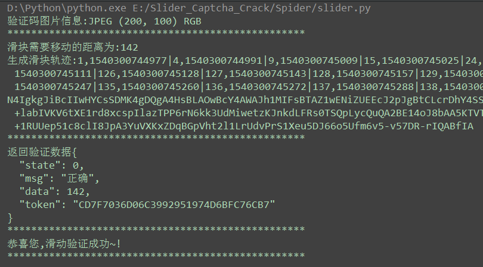

某教育网站滑动验证码破解 
===========================
   
### 某教育网站 - http://gkcf.jxedu.gov.cn/
|Author|:sunglasses:Henryhaohao:sunglasses:|
|---|---
|Email|:hearts:1073064953@qq.com:hearts:

    
****
## :dolphin:声明
### 软件代码均仅用于学习交流，请勿用于任何商业用途！感谢大家！
## :dolphin:介绍
### 该项目为[某教育网站](http://gkcf.jxedu.gov.cn/)滑动验证码的破解
- **项目介绍:**
> 1.使用Pillow(PIL)库实现验证码图片的切割,黏贴,还原,缺口距离判断等图片操作<br>

> 2.运用简单加速度知识模拟出滑块运动轨迹,生成data参数,并进行参数加密
- **破解文件:Spiders目录下的slider.py**`
## :dolphin:运行环境
**Version: Python3**
## :dolphin:安装依赖库
```
pip3 install -r requirements.txt
```
## :dolphin:运行截图
> - **滑块截图**<br><br>


> - **运行破解**<br><br>



## :dolphin:**总结**
> **最后，如果你觉得这个项目不错或者对你有帮助，给个Star呗，也算是对我学习路上的一种鼓励！<br>
 哈哈哈，感谢大家！笔芯哟~**:cupid::cupid:


